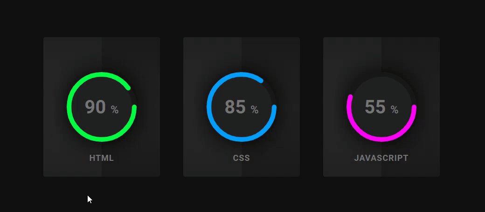

# Desafio-CSS

Iniciei este desafio de 30 dias de CSS para praticar e aprimoramento nas minhas habilidades com o CSSgit.

Foi lançado pela Milena Carecho com o objetivo de grande oportunidade de aprendizado, troca de experiências e colocar em prática as habilidades com CSS.

Você pode saber mais sobre o desafio aqui:
https://lnkd.in/eAwtciR

####dia 1 - Ícones em camadas

####dia 2 - Loading animado

####dia 3 - Mudança de cor do texto

####dia 4 - Efeito neon do botão

####dia 5 - Efeito pulsar do ícone

####dia 6 - Customização do checkbox

####dia 7 - Texto revelado com animação de fumaça

####dia 8 - Galeria de fotos em 3D

####dia 9 - Animação do ícone "menu hambúrguer"

####dia 1o - 3D flip card

####dia 11 - Animação de chuva

####dia 12 - Animação de relógio

####dia 13 - Texto alternativo

####dia 14 - Preload animado

####dia 15 - Efeito de retrato

####dia 16 - Efeito hover nos cards

####dia 17 - Animação no background colorido

####dia 18 - Grid responsivo

####dia 19 - Animação do efeito de clip de background

####dia 20 - Super Mario

####dia 21 - Efeito hover nas imagens

####dia 22 - Slideshow

####dia 23 - Barra de progressão circular

####dia 24 - Login

####dia 25 - Pesquisa de satisfação

####dia 26 - Slideshow

####dia 27 - Hover nos botões

####dia 28 - Scrolling effects

####dia 29 - Volta ao mundo

####dia 30 - Fogos de artifício

